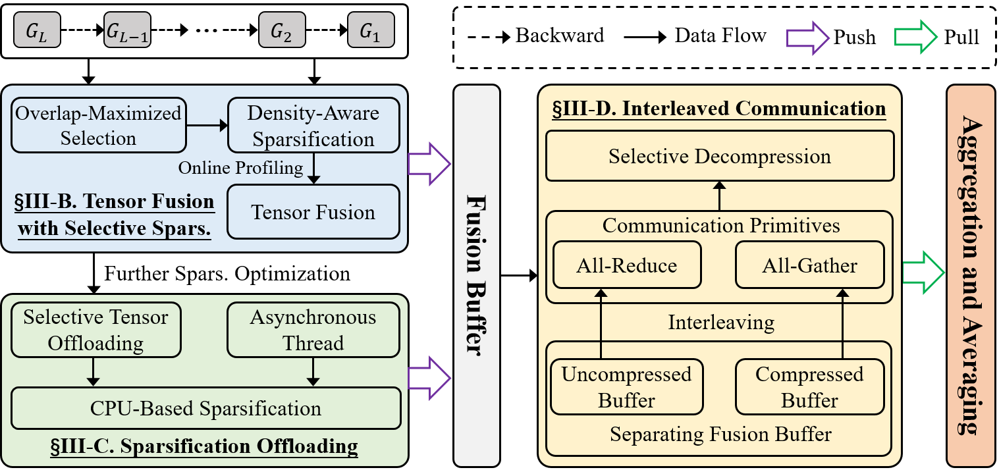

# SSFusion: Tensor Fusion with Selective Sparsification for Efficient Distributed DNN Training


__SSFusion__ proposes a new selective sparsification tensor fusion mechanism for data-parallel distributed DNN training that addresses the limitations of high compression overhead or low convergence accuracy caused by existing tensor fusion schemes. __SSFusion__ performs selective sparsification before tensor fusion, instead of per-tensor or multi-tensor sparsification, to reduce compression overhead while maintaining convergence accuracy. __SSFusion__ also proposes an efficient sparsification offloading scheme to further speed up compression, and an interleaved communication scheme to improve sparse communication efficiency.
This repository contains __SSFusion__'s source code, as well as a set of benchmarking scripts for some popular open-source distributed DNN training systems with state-of-the-art tensor fusion and sparsification schemes. 


# Introduction
This code repository covers:
### __SSFusion Framework__
- SSFusion(Naive): Tensor fusion with selective sparsification
- SSFusion-O: Efficient sparsification offloading in SSFusion
- SSFusion-I: Interleaved communication in SSFusion


### __State-of-the-art tensor fusion schemes__

<!-- - [WFBPS](https://github.com/horovod/horovod) -->
- [HiPress](https://gitlab.com/hipress/hipress)
- [Espresso](https://github.com/zhuangwang93/Espresso)
- [OkTopk](https://dl.acm.org/doi/pdf/10.1145/3126908.3126912)
- [OMGS](https://github.com/HKBU-HPML/OMGS-SGD)
- [Cupcake](https://github.com/zhuangwang93/Cupcake)
- [SparDL](https://ieeexplore.ieee.org/document/10597962)


### __State-of-the-art sparsification algorithms__

- [DGC](https://arxiv.org/pdf/1712.01887.pdf)
- [Gaussiank](https://arxiv.org/pdf/1911.08772.pdf)
- [Redsync](https://www.sciencedirect.com/science/article/pii/S0743731518308657)
- [SIDCo](https://proceedings.mlsys.org/paper_files/paper/2021/file/fea47a8aa372e42f3c84327aec9506cf-Paper.pdf)
- [Randomk](https://dl.acm.org/doi/10.5555/3327345.3327357)


# Implementation


## **__SSFusion__** System Architecture
We use the [PyTorch](https://github.com/pytorch/pytorch) framework and implement the prototype system of __SSFusion__ based on the [Horovod](https://github.com/horovod/horovod) distributed training framework using NCCL as the communication library.
<!-- The overview of our system is as follows:  -->
<!--  -->
<!-- <center class ='img'>

</center> -->


In our system of SSFusion, each worker contains a __Generator__ module for generating fusion buffer with selective sparsification, which provides  `Sparsification offloading` and `Interleaved communication` operations for efficient data-parallel distributed DNN training; __Controller__ module for controlling a series of operations such as sparsified gradient selecting, offloading, pushing, pulling, and interleaving communication in the fusion buffer; a __Selective Sparsification__ module for performing selective sparsification during backpropagation; a __Tensor Fusion__ module for performing tensor fusion after backpropagation.

## **__SSFusion__** System Overview
The workflow of the __SSFusion__ System：
<center class ='img'>

</center>

# Installation


## **Prerequisites**
- [CUDA-12.0](https://developer.nvidia.com/cuda-12-0-0-download-archive)
- [Python >= 3.12](https://www.python.org/downloads/release/python-312)
- [NCCL-2.8.3](https://github.com/NVIDIA/nccl)
- [PyTorch-2.3.+](https://github.com/pytorch/pytorch)
- [OpenMPI-4.0.+](https://www-lb.open-mpi.org/software/ompi/v4.0/)
- [Horovod-0.28.1+](https://github.com/horovod/horovod)
- [Numpy](https://github.com/numpy/numpy)
- [TensorboardX](https://github.com/lanpa/tensorboardX)
- [Tqdm](https://github.com/tqdm/tqdm)

## **Get the code**
```
git clone https://github.com/ICDE26-SSFusion/SSFusion.git
cd SSFusion
pip install -r requirements.txt
HOROVOD_GPU_OPERATIONS=NCCL pip install horovod==0.28.0
```

if pip installation fails, please try to upgrade pip via `pip install --upgrade pip`. If [Horovod](https://github.com/horovod/horovod) installation with NCCL failed, please check the installation [guide](https://horovod.readthedocs.io/en/stable/install_include.html).

## **Quick start**
The primary benchmark is provided in `example`. 
For example, we can use the following command to run the benchmark on 8 GPUs, with compression algorithm as dgc, communication primitives as All-Reduce and All-Gather, memory as residual.
 
**To run BERT-large training job:**
```
cd SSFusion/example/nlp/bert/scripts
bash run_squad_bert.sh
```

**To run GPT2-large training job:**
```
cd SSFusion/example/nlp/gpt
bash run_clm_no_trainer_hvd_103.sh
```

**To run ViT-large training job:**
```
cd SSFusion/example/cv/vit
bash run_imagenet_no_trainer.sh
```

**To run ResNet-152 training job:**
```
cd SSFusion/example/cv/resnet
bash run_imagenet_resnet152.sh
```


## **Papers**

SSFusion: Tensor Fusion with Selective Sparsification for Efficient Distributed DNN Training

<!-- If you are using this repository for your paper, please cite our work
```
@inproceedings{ming2025SSFusion,
  title={SSFusion: Tensor Fusion with Selective Sparsification for Efficient Distributed DNN Training},
  author={Zhangqiang, Ming and Yuchong, Hu and Xinjue, Zheng and Wenxiang, Zhou and Dan, Feng},
  booktitle={Proceedings of the 34th ACM International Symposium on High-Performance Parallel and Distributed Computing},
  url={https://doi.org/10.1145/3731545.3731581}
  year={2025}
}
``` -->

## **Referred Datasets**

- Wikitex-2/103: [https://huggingface.co/datasets/wikitext](https://huggingface.co/datasets/wikitext)
- SQuAD: [https://rajpurkar.github.io/SQuAD-explorer/](https://rajpurkar.github.io/SQuAD-explorer/)
- ImageNet: [https://www.image-net.org/](https://www.image-net.org/)
- CIFAR-100: [https://www.cs.utoronto.ca/~kriz/cifar.html](https://www.cs.utoronto.ca/~kriz/cifar.html)

## **License**

See [LICENSE](https://github.com/ICDE26-SSFusion/SSFusion/blob/main/LICENSE.txt).


